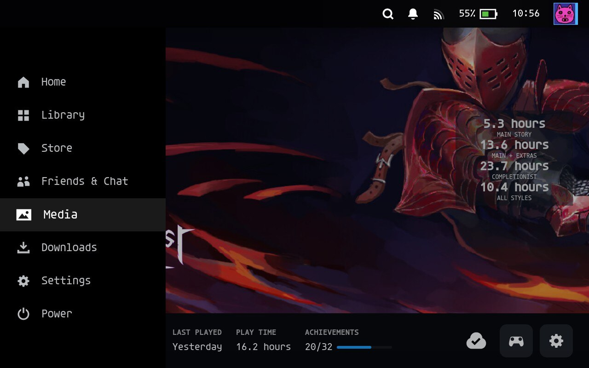
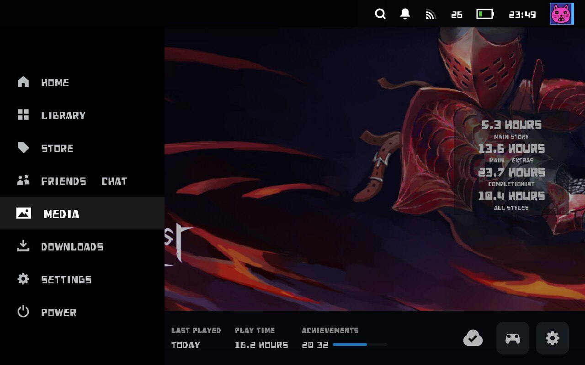
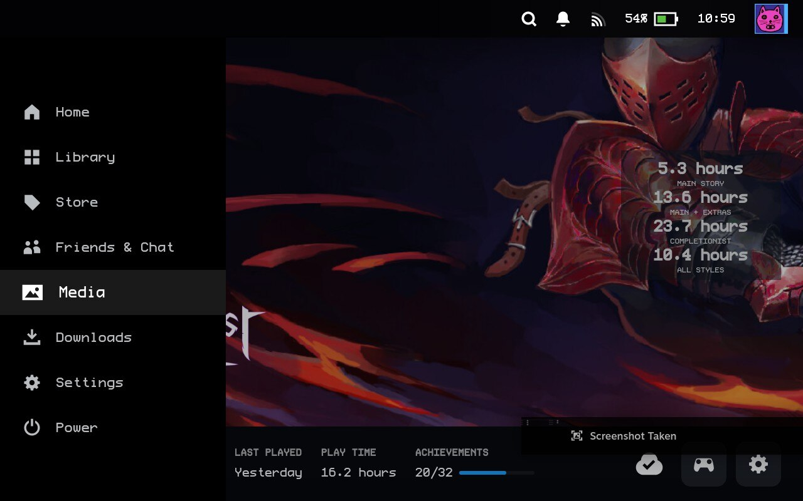

# Steam Deck Nerd Fonts

This theme adds a variety of nerd fonts. They have been stripped down to 
latin chars and currency symbols. The unmodified fonts can be found at 
https://github.com/ryanoasis/nerd-fonts.  This is not associated with ryanoasis
or the Nerd Font aggregator.

## Examples

### Agave

### Heavydata Example

### Profont Windows

## How to
1. Add new `.ttf` font to `./theme/nerd-fonts`
1. Add license to `./theme/font-licenses`
1. `cd ./theme/nerd-fonts`
1. `bash ../../extract.sh`
1. Remove the original unreduced font
1. `bash ./generate_css.sh`
1. `bash ./generate_patches.sh | pbcopy`
1. Replace data in `./theme/theme.json` at `patches.Font.values`
